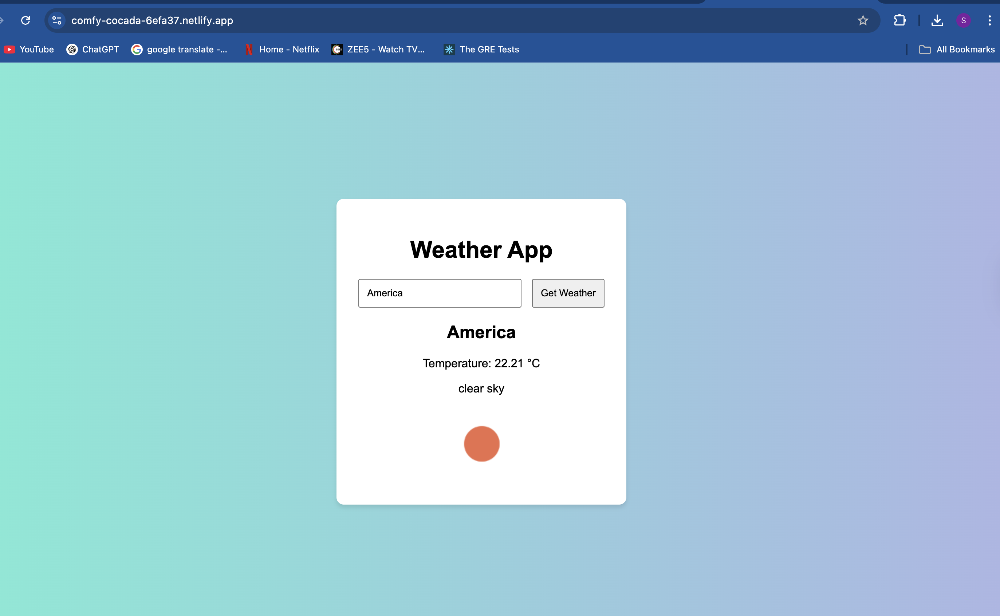

# Weather-App


# 🌤️ Weather App

A simple weather web application built with HTML, CSS, and JavaScript that allows users to search for current weather information by city name using the OpenWeatherMap API.

## 🚀 Features

- Search weather by city name
- Displays:
  - City name
  - Temperature in Celsius
  - Weather description (e.g., "clear sky", "rain")
  - Weather icon
- Responsive and clean user interface

## 🛠️ Technologies Used

- HTML5
- CSS3
- JavaScript (Vanilla)
- [OpenWeatherMap API](https://openweathermap.org/api)

## 🌐 Demo

 <!-- Replace or remove this line if no screenshot is available -->


```bash
git clone https://github.com/your-username/weather-app.git
cd weather-app
